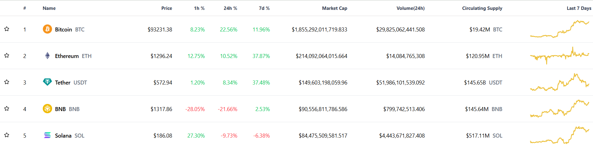

# 🪙 Crypto  Tracker

A responsive and real-time cryptocurrency price tracker built using **React**, **Tailwind CSS**, and **Binance WebSocket API**.

## 🚀 Features

- 📊 Displays key metrics: current price, % change (1h, 24h, 7d), market cap, volume, and circulating supply
- 🖼 Coin logos with price trend graphs
- 🌐 Fully responsive with smooth horizontal scrolling for wide tables
- 🌑 Light and performant UI using Tailwind CSS

## 📸 Preview

 

## 🔧 Tech Stack

- [React](https://reactjs.org/)
- [Tailwind CSS](https://tailwindcss.com/)
- [CoinGecko API](https://www.coingecko.com/en/api) *(for static coin data)*

## 📦 Installation

```bash
git clone https://github.com/Mohi-th/Crypto_Tracker.git
cd crypto-tracker
npm install
npm run dev
